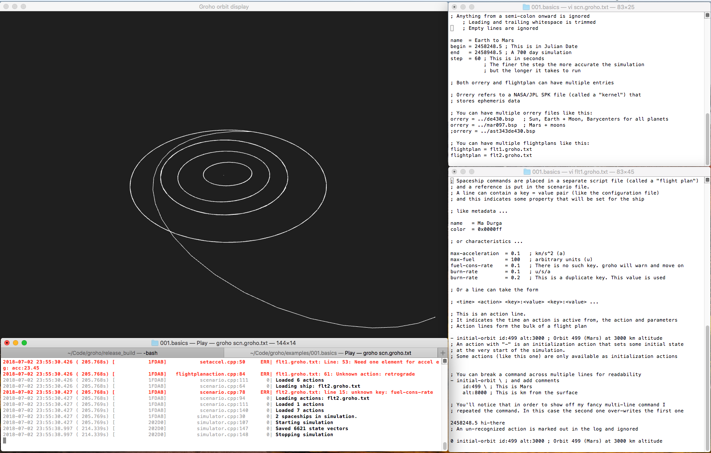
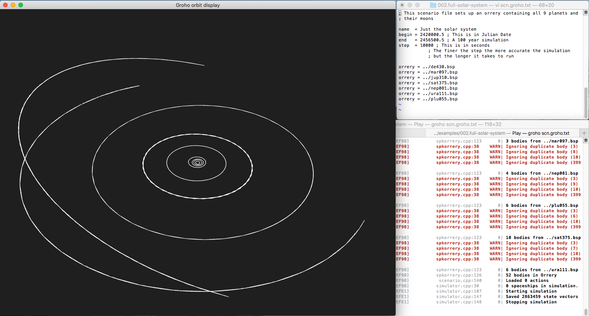

_This code is in the middle of a rewrite. For the last working version please
see the [master branch](https://github.com/kghose/groho/tree/master) and
[releases](https://github.com/kghose/groho/releases)._

Groho ( গ্রহ )
=====

[](https://github.com/kghose/groho/actions?query=workflow%3ATests)
[](https://github.com/kghose/groho/actions?query=workflow%3ASimulator)

Groho is a simulator for space flight, communication and warfare within the
solar system.

Space is unimaginably vast. My goal is to create a simulator that will give us
an appreciation of just how lonely even our tiny corner of the universe is. We
define a solar system model (the Orrery - based on NASA's planetary data), set
up space craft scripts (Flight Plans), and then sit back and watch the action
unfold. The program makes it easy to setup, run, save, modify, inspect and
compose (combine together) simulations. 

My hope is that we will come away with an understanding of basic orbital
manuevers, an intuition of the time delays in communicating and coordinating
across the solar system and a feel for what life will be like for our
descendants who set sail away from the home planet.

*Groho (গ্রহ) is the Bengali word for planet. Grohomondol (গ্রহমণ্ডল) is the
word for planetary system but is more of a mouthful.*

# Quick start

The simulator uses two input files: a **scenario file** and a **plot file**. The
scenario file lists out the initial conditions for the simulation, the orrery
model and the flight plans for any spacecraft in the simulation. The plot file
lists instructions for how to plot the simulation data.

_For the restless, you can jump to this annotated
[example](examples/001.basics/scn.groho.txt) to get started_ 

## Invocations
Simulator loop: monitor changes in scenario and plot files and rerun and replot
simulation continuously
```
groho loop scn-file.txt plot-file.txt sim-folder chart.pdf
```

Simulate scenario and exit
```
groho sim scn-file.txt sim-folder
```

Chart simulation and exit
```
groho chart plot-file.txt sim-folder chart.pdf
```

# Scenario file manual

The easiest way to learn about scenario files is to look at the annotated
[example](examples/001.basics/scn.groho.txt)

To get a list of spacecraft programs and how to use them do
```
groho programs
```

## Orrery model
You pass a list of kernel files to the simulator. Optionally, you can indicate a
subset of NAIF codes that the simulator should load for the kernel file.

```
spk de432s.bsp

pick 809 899
spk nep086.bsp 
```
The first `spk` command tells the simulator to load everything in the
`de432.bsp` kernel. The `pick` prepares the simulator to load only `809` and
`899` from the next `spk` kernel.

A SPK file contains barycenters as well as physical bodies. Often ephemeris are
stored relative a barycenter. For example:
```
301 -> 3 -> 0
299 -> 2 -> 0
809 -> 8 -> 0
899 -> 8 -> 0
```

When loading objects the simulator follows the following rules

1. If a body is picked but the body is referenced to an object that has not been
   loaded, this reference object is also loaded and so on, recursively.
1. If a barycenter and the main body of the barycenter are both loaded, the
   barycenter is used for coordinate transforms but is not used for gravity
   computations: the main body is used. The trajectory of the barycenter is
   also, in this case, not saved.

In the given example, the barycenter 8 is not used for gravity computations
since 899 is loaded. 


## Flight plans

Flight plans start with a line indicating the name of the spacecraft

```
plan Durga
```

This is followed by a list of **events**. Each event specifies a time, a
spacecraft **program** and how it should run. For example the line:

```
2050.01.01:0.5 orbit 301 200x200
```

will turn on a program that thrusts the spaceship till it achieves a 200x200 km
orbit around the moon. Programs terminate once their goal has been achieved or,
if they are a timed program, once their time runs out.

Each program has access to the state of the solarsystem (modeling a perfect IMU
and perfect knowledge of the solar system) and produces only one output: a
thrust vector for the spaceship.

Multiple programs can not run at the same time. If a program's event time occurs
before the previous program has terminated, it will be put into a
queue, so that they will run as soon as the earlier program has finished.

To describe another spacecraft's flight plan, simply use another `plan`
statement. All events coming after this, will be associated with this new
spacecraft. 

## The `insert` directive
Multiple files can be combined to form the complete scenario file. For example

```
start 2050.01.01:0.5
end 2055.01.01:0.5

spk de432s.bsp

pick 809 899
spk nep086.bsp 

insert flightplan1.txt
insert flightplan2.txt
```
is a neat way of splitting out the flightplans of the two spacecraft in the
simulation into two additional files. This can make the writing of the
simulation more manageable.

# Plot file manual


# Developer

The code needs a c++17 compiler.

## Docs
- [Design](docs/Readme.md)
- [High level roadmap](docs/roadmap.md)


```
cd examples/001.basics
../../release_build/groho scn.groho.txt 
```



```
cd examples/002.full-solar-system
../../release_build/groho scn.groho.txt 
```


[](https://circleci.com/gh/kghose/groho/tree/master)

<!-- TOC -->

- [Quick start](#quick-start)
  - [Invocations](#invocations)
- [Scenario file manual](#scenario-file-manual)
  - [Orrery model](#orrery-model)
  - [Flight plans](#flight-plans)
  - [The `insert` directive](#the-insert-directive)
- [Plot file manual](#plot-file-manual)
- [Developer](#developer)
  - [Docs](#docs)
- [Features and use cases](#features-and-use-cases)
  - [This is not an interactive simulation](#this-is-not-an-interactive-simulation)
  - [This is not an n-body simulation](#this-is-not-an-n-body-simulation)
  - [Relativistic effects](#relativistic-effects)
- [Compilation/building](#compilationbuilding)
  - [Compile](#compile)
- [Manual/Tutorial](#manualtutorial)
  - [Getting the data](#getting-the-data)
  - [Simulation files](#simulation-files)
    - [Actions](#actions)
    - [Signals](#signals)
    - [Restarts](#restarts)
  - [What does a ship know about the world?](#what-does-a-ship-know-about-the-world)
  - [Orbit view interactions](#orbit-view-interactions)
  - [[Developer documentation](docs/Readme.md)](#developer-documentationdocsreadmemd)
  - [Meta](#meta)
    - [Why is the tutorial/manual in the form of commented examples?](#why-is-the-tutorialmanual-in-the-form-of-commented-examples)
    - [Why do you have stuff in the manual/examples that isn't implemented yet?](#why-do-you-have-stuff-in-the-manualexamples-that-isnt-implemented-yet)
- [Physics/astronautics word salad](#physicsastronautics-word-salad)
- [Related software](#related-software)
  - [NASA's GMAT](#nasas-gmat)
  - [Solar System Voyager (SSVG)](#solar-system-voyager-ssvg)
  - [NASA Ames Research Center Trajectory Browser](#nasa-ames-research-center-trajectory-browser)
  - [Rebound by Hanno Rein](#rebound-by-hanno-rein)
  - [Orbiter by Martin Schweiger](#orbiter-by-martin-schweiger)
  - [Bussard by Phil Hagelberg](#bussard-by-phil-hagelberg)
  - [SolarSystemOrbiter](#solarsystemorbiter)
  - [Poliastro by Juan Luis Cano Rodríguez](#poliastro-by-juan-luis-cano-rodríguez)
  - [Celestia](#celestia)
  - [Asterank](#asterank)
- [Thanks](#thanks)
  - [Components](#components)
  - [Dev tooling](#dev-tooling)
- [Meta: Why did you put everything in this one document?](#meta-why-did-you-put-everything-in-this-one-document)
  - [Developer notes](#developer-notes)

<!-- /TOC -->

# Features and use cases

This simulator is designed to help gain intuitions of how near-future space 
flight within the solar system would look like. To this end it allows us to:

- Simulate the flights and interactions of hundreds of spacecraft
- Simulate decades long journeys in reasonable CPU time.
- Compose multiple journeys together to make a complex simulation from simpler ones
- Perform reproducible simulations (seeded random number generators, stable numerical calculations)
- Compare multiple versions of a simulation


## This is not an interactive simulation

The simulation works by setting up a scenario and then letting everything evolve
according to physical law and scripted events. The experimenter influences the
simulation only through the choice of scenario and script parameters.


## This is not an n-body simulation

The motions of planets, moons and larger asteroids are taken from existing 
ephemeris and are not propagated via n-body gravitational simulations. The 
expected time scales of the simulations (upto a century) are short enough that 
existing ephemeres will do fine and will save us a lot of computation. 
The gravitational effect of each planet, moon and asteroid on a ship is taken 
into account.


## Relativistic effects

Communications over solar-system distances are interestingly affected by the
finite speed of light. The simulation enables the calculation of when an event
at one location is detected at other locations/ships.


# Compilation/building


**This code requires a C++17 compiler.** In case you need it, there is a 
[Dockerfile](.circleci/dockerfile) that installs a recent GCC. I used the 
following creature comforts from C++17
- [`std::optional`](https://en.cppreference.com/w/cpp/utility/optional)
- [structured bindings](http://wg21.link/p0217r3)
- [typename in a template template parameter](http://www.open-std.org/jtc1/sc22/wg21/docs/papers/2014/n4051.html)
- [`[[maybe_unused]]` attribute](https://en.cppreference.com/w/cpp/language/attributes/maybe_unused)


## Compile

```
git clone git@github.com:kghose/groho.git
cd groho && \
mkdir build && \
cd build && \
cmake -DCMAKE_BUILD_TYPE=Release .. && \
make
```

# Manual/Tutorial

```
groho --help  # Get help about the program
groho --actions # List available spacecraft actions 
```

## Getting the data

Groho simulates the solar system using data produced by NASA/JPL. This data
is distributed by NASA as planetary kernels found [here][nasa-kernels]. 
There is a [script](examples/bsp-script.sh) under the examples directory that 
I used to pull in all the `.bsp` files for the solar system. Be aware that 
this is a few GB worth of data. You are free to use whatever kernels you wish.

[nasa-kernels]: https://naif.jpl.nasa.gov/pub/naif/generic_kernels/spk/

I save all these kernels under the [`examples`][ex-dir] directory.

## Simulation files

Groho uses a **scenario file**, one or more **flight plans** and one or more 
**annotation files** to run a simulation and organize information on screen. 
Simulation files can be edited with your favorite editor and versioned with
your favourite versioning system. `groho` is independent of all this. What
`groho` does is monitor changes to the simulation files on the file system and 
updates the simulation computations when the files change.

In the [`examples`][ex-dir] directory are a series of tutorials-by-example. 
Each directory contains a scenario file, flight plans and annotation files
with a mixture of commentary and code to show you the syntax. 

[ex-dir]: examples/

Start with the [basic example][basic-ex]: Read the [simulation file][basic-sim-file],
[flight plan file][basic-flt-plan1] (there are [two][basic-flt-plan2]) and the
[annotation file][basic-ann-file].

[basic-ex]: examples/001.basics
[basic-sim-file]: examples/001.basics/scn.groho.txt
[basic-flt-plan1]: examples/001.basics/flt1.groho.txt
[basic-flt-plan2]: examples/001.basics/flt2.groho.txt
[basic-ann-file]: examples/001.basics/annotate.groho.txt

After that, just browse the examples to get a feel for what else is available.

### Actions

Flight Plan actions are commands to a ship to do something. Actions can take
place at a particular time or be triggered by a particular world state. Actions
happen in sequence. 

### Signals

A flight plan can create signals on behalf of a ship. Signals travel radially 
out at the speed of light from their point of origin and can be received by
other ships once they are within the sphere. Once the signal has spread past 
the furthest simulation object it is removed, since all ships have received
the signal by that time. Signals can be shaped, such that they have different 
amplitudes in different directions. Ship receivers can have different 
sensitivities to signal intensity.

### Restarts

Restarts allow
1. An existing complete simulation to be rerun with an extended end time without
   having to recompute the previously computed segment
1. An existing simulation to be rerun intelligently conserving previously computed
   parts.

Restarts are have not been implemented yet but features are implemented with
restarts in mind.


## What does a ship know about the world?

We assume that every ship has access to perfect knowledge about all Orrery
objects. Every ship has access to perfect information about itself, but not
others. In order to get information about other ships it has to make use of
signals (which travel at the speed of light). Signals can be radar/lidar which
allow ranging, velocity and some identity information or data packets broadcast
from another ship, which can carry arbitrary information.

## Orbit view interactions

Dragging the mouse will orbit the camera. Scrolling will zoom in and out. 
Pressing ALT while scrolling will move back and forth in time. The up/down 
cursor keys cycle through the planets/asteroids/spacecraft and the left/right keys 
cycle through the satellites of said planets allowing us to center the camera on 
different objects. 

Pressing `p` will toggle display of body paths, `m` will toggle display of the
fixed size markers, `b` will toggle display of the scaled circles that
represent the actual size of the bodies, and `o` will toggle the information
overlay.

Once you have sufficient objects in the simulation, it becomes hard to find things. 
Whatever view you can get to using the mouse/keyboard, you can also get to using
the `view` annotation and in a much more effective way. Check out the documentation.

*Eventually the [tutorial here](docs/tutorial.md) will be copied over into this space.*

## [Developer documentation](docs/Readme.md)

## Meta 

### Why is the tutorial/manual in the form of commented examples?

I personally learn well by example, so I wanted to try this out. I also use
these tutorial scripts as ways to prototype proposed simulation file syntax,
to see how it could look and work.

Lastly, for a hobby project, it's a wasteful duplication of effort to have to 
create/update example scripts and a separate manual or tutorial 
(where I'd have to paste in snippets of code anyway). I chose to use comments 
in the simulation files as a reliable way to keep upto-date documentation. 

### Why do you have stuff in the manual/examples that isn't implemented yet?

I'm aspirational. But seriously, I use the manual and the example input files as
functional specifications. As I build out more of the software, more of the
specifications are implemented. Please file bug reports as necessary.


# Physics/astronautics word salad

There is a bunch of interesting physics and math behind orbital maneuvers.
From Robert A. Braeunig's [page][bob] we have the following named maneuvers:

- Hohmann transfer orbit
- One-Tangent Burn
- Spiral transfer
- Simple plane change

[bob]: http://www.braeunig.us/space/orbmech.htm#maneuver

And, from [poliastro]

- Lambert’s problem
- Bi-elliptic transfer


# Related software

There is a big list at https://github.com/orbitalindex/awesome-space

## NASA's GMAT

NASA's [GMAT] software ([github][GMAT-github]) is probably the be-all and end-all 
of spacecraft simulation. It would probably have sufficed for my needs 
but I like to program computers and learn math, 
so I stubbornly rolled my own to my own (much more limited) specifications.

[GMAT]: http://gmatcentral.org/display/GW/GMAT+Wiki+Home
[GMAT-github]: https://github.com/haisamido/GMAT

## Solar System Voyager (SSVG)

"[SSVG] is simulation software which enables users to fly their own space probes in the solar system.  Each space probe has three propulsion systems: a chemical propulsion engine, an electric propulsion engine, and solar sail.  Fly your own space probe in the precisely simulated Solar System."

I found SSVG on Oct 14th and browsing through the manual][SSVG-manual] found that
the author had a very similar concept (including the name "Flight plan") and a
cool looking GUI for writing flight plans! I had, by then, however, discarded the
idea of timed actions in favor of event/condition driven actions. But it is
cool for me to see a "flight plan" like concept, because I have so far been
unsuccessful in finding what a real flight plan, or set of propulsive maneuvers
actually looks like.

[SSVG]: https://github.com/whiskie14142/SolarSystemVoyager/
[SSVG-manual]: https://github.com/whiskie14142/SolarSystemVoyager/blob/master/doc/SSVG_UsersGuide-en.pdf


## NASA Ames Research Center Trajectory Browser

I ran into the [Trajectory Browser] while looking for what interplanetary
mission programs look like. It's awesome. However
> All trajectories are pre-computed and stored in a database that contains all the 
solutions. In order to compute new trajectories to a non-existing object and/or 
if you wish to add a particular object that is not currently available, please 
contact us and we will have it included.

[Trajectory Browser]: https://trajbrowser.arc.nasa.gov/traj_browser.php

## Rebound by Hanno Rein

[REBOUND] is an N-body integrator. Groho completely punts on this aspect of the
simulation and relies on the NASA/JPL ephemeris kernels (which in turn are
products of a constrained N-body simulation). The REBOUND code is a good place
to explore different integrators and the rebound paper is a good place to
readup about Symplectic integration. If you are into that kind of thing.

[REBOUND]: https://github.com/hannorein/rebound

## Orbiter by Martin Schweiger

I've used [Orbiter](http://orbit.medphys.ucl.ac.uk/) since 2001 or so. It was
my main instrument of thesis procrastination. It's very detailed and visually
rich and a blast to play. It's an interactive simulation where you fly space
craft with your keyboard and mouse. It's closed source and its internals are 
a little opaque. For example, I do not know
what orrery model it uses or if it does an n-body simulation, if it has
accurate models for the axial tilt of the planets and moons or these are
just arbitrary and so on.

## Bussard by Phil Hagelberg

[Bussard](https://technomancy.itch.io/bussard) is a cool hacking/spaceflight game
where you write complex programs to fly your spaceship to solve puzzles.

## SolarSystemOrbiter

[SolarSystemOrbiter](https://github.com/madoee/SolarSystemOrbiter) -
"Plot the orbits of the planets in our Solar System and calculate the Hohmann Transfer Orbits to transfer your rocket ship from one planet to the other and back." 

## Poliastro by Juan Luis Cano Rodríguez

[poliastro] is an open source collection of Python subroutines for solving 
problems in Astrodynamics and Orbital Mechanics.

[poliastro]: http://docs.poliastro.space/en/latest/index.html

## Celestia

[Celestia](https://github.com/CelestiaProject/Celestia) - 
"A real-time space simulation that lets you experience our universe in three dimensions."

## Asterank

[asterank](https://github.com/typpo/asterank) - "Using publicly available data and scientific papers, the project evaluates the economic prospects of mining nearly 600,000 cataloged asteroids."
They are live at http://www.asterank.com/. 

# Thanks

## Components
Included in the code are the following fine pieces of software

1. [loguru](https://github.com/emilk/loguru) from Emil Ernerfeldt for the logging
1. [CLI11](https://github.com/CLIUtils/CLI11) from Henry Schreiner for the CLI 
1. [catch(2)](https://github.com/catchorg/Catch2) from Phil Nash for unit tests
1. [magnum/corrade][magnum] from Mosra (Vladimír Von­druš) for everything graphical

## Dev tooling
I was helped in writing the code by

1. [The Clang compiler][clang] and `clang-format`  
1. [Visual Studio Code][vs-code] from microsoft which does everything 
   I want in a code editor (Though the debugger integration needs some work.)
1. [Instruments]. I dislike Xcode, but love Instruments
1. [markdown-toc][mtoc] from Alan Walk. I used that to generate the 
   table of contents in markdown documents, which allowed me to 
   consolidate my documentation.


[vs-code]: https://code.visualstudio.com/
[clang]: https://clang.llvm.org/
[Instruments]: https://help.apple.com/instruments/mac/current/
[mtoc]: https://github.com/AlanWalk/Markdown-TOC


# Meta: Why did you put everything in this one document?

When I started the project I had text documents all over the place. It seemed
like a good idea - one document for an idea or topic. Pretty soon I had multiple
docments with similar ideas/topics and I began to forget that I had them.
Discoverability began to be a problem. So I decided to try packing stuff into
as few documents as possible. You don't have to read all this at once, you can
look for things using your browser or text editor's search function and not
have to keep jumping from document to document. I will try to use bookmarks
to help orientation. It's an experiment - tell me if you hate it.

## Developer notes

That said, there is a separate file, which contains 
[some war stories about C++ and implementation](src/Readme.md).