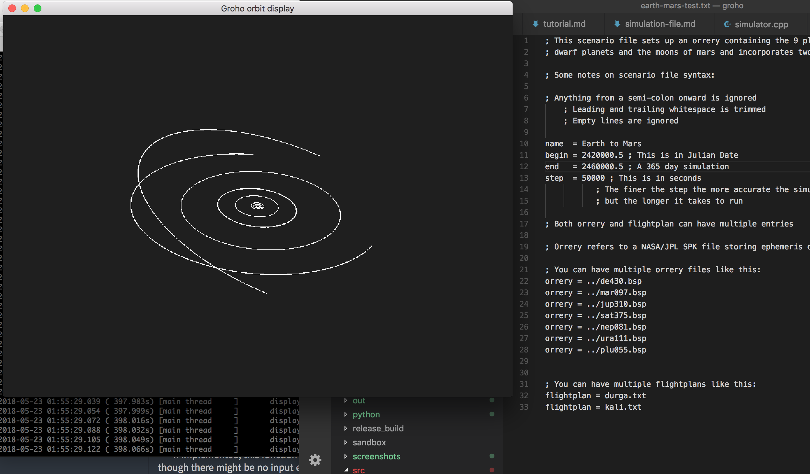

Groho ( গ্রহ )
=====
Groho is a simulator for inter-planetary travel and warfare.

The simulator aims to give the user intuitions of how inter-planetary travel, 
commerce and conflict would play out in the near future within the solar system. 
There is no faster than light travel, though there are no limits to 
how powerful spaceship propulsion can be. 

Spacecraft actions are defined using scripts called flight plans. The user
defines the solar system model, initial conditions (such as number and disposition
of spaceships) and the simulation evolves according to natural law and
flight plan actions. The program makes it easy to setup, run, save, modify, inspect 
and compose (combine together) simulations. 

*Groho (গ্রহ) is the Bengali word for planet. Grohomondol (গ্রহমণ্ডল) is the word for 
planetary system but is more of a mouthful.*

```
groho examples/earth-mars.txt 
```



[](https://opensource.org/licenses/MIT)
<!-- [](https://circleci.com/gh/kghose/groho/tree/master) -->

<!-- TOC -->

- [In a bit more detail](#in-a-bit-more-detail)
    - [Features and use cases](#features-and-use-cases)
    - [This is not an interactive simulation](#this-is-not-an-interactive-simulation)
    - [This is not an n-body simulation](#this-is-not-an-n-body-simulation)
    - [Relativistic effects](#relativistic-effects)
- [Compilation/building](#compilationbuilding)
    - [Dependencies](#dependencies)
    - [Compile](#compile)
- [Manual/Tutorial](#manualtutorial)
    - [Getting the data](#getting-the-data)
    - [Tutorial/manual](#tutorialmanual)
        - [Simulation files](#simulation-files)
            - [Why is the tutorial/manual in the form of commented examples](#why-is-the-tutorialmanual-in-the-form-of-commented-examples)
        - [Orbit view interactions](#orbit-view-interactions)
- [Related software](#related-software)
    - [NASA's GMAT](#nasas-gmat)
    - [Bussard by Phil Hagelberg](#bussard-by-phil-hagelberg)
    - [SolarSystemOrbiter](#solarsystemorbiter)
- [Thanks](#thanks)
- [Meta: Why did you put everything in this one document?](#meta-why-did-you-put-everything-in-this-one-document)
    - [Some other documents of interest](#some-other-documents-of-interest)

<!-- /TOC -->


# In a bit more detail


## Features and use cases

This simulator is designed to help gain intuitions of how near-future space 
flight within the solar system would look like. To this end it allows us to:

- Simulate the flights and interactions of hundreds of spacecraft
- Simulate multi-year journeys in reasonable CPU time.
- Compose multiple journeys together to make a complex simulation from simpler ones
- Perform reproducible simulations (seeded random number generators, stable numerical calculations)
- Compare multiple versions of a simulation


## This is not an interactive simulation

The simulation works by setting up a scenario and then letting everything evolve 
according to physical law and scripted events. The experimenter influences the 
simulation only through the choice of scenario and script parameters.


## This is not an n-body simulation

The motions of planets, moons and larger asteroids are taken from existing 
ephemeris and are not propagated via n-body gravitational simulations. The 
expected time scales of the simulations (upto a century) are short enough that 
existing ephemeres will do fine and will save us a lot of computation. 
The gravitational effect of each planet, moon and asteroid on a ship is taken 
into account.


## Relativistic effects

Communications over solar-system distances are interestingly affected by
the finite speed of light. The simulation enables the calculation of when an event 
at one location is detected at other locations/ships.


# Compilation/building

**This code requires a C++17 compiler.** 
`std::optional` is one of the C++17 features used.

## Dependencies

- [Magnum/Corrade][magnum]

You should follow the instructions on the [Magnum project page][magnum-install], 
but in brief:

macOS: `brew install mosra/magnum/magnum` and `brew install mosra/magnum/corrade`

## Compile

```
git clone git@github.com:kghose/groho.git
cd groho && \
mkdir build && \
cd build && \
cmake -DCMAKE_BUILD_TYPE=Release .. && \
make
```

# Manual/Tutorial

## Getting the data

Groho simulates the solar system using data produced by NASA/JPL. This data
is distributed by NASA as planetary kernels found [here][nasa-kernels]. 
There is a [script](examples/bsp-script.sh) under the examples directory that 
I used to pull in all the `.bsp` files for the solar system. Be aware that 
this is a few GB worth of data.

[nasa-kernels]: https://naif.jpl.nasa.gov/pub/naif/generic_kernels/spk/

I save all these kernels under the [`examples`][ex-dir] directory.


## Tutorial/manual

### Simulation files

Groho uses a **scenario file**, one or more **flight plans** and one or more 
**annotation file** to run a simulation and organize information on screen. 
In the [`examples`][ex-dir] directory are a series of tutorials-by-example. 
Each directory contains a scenario file, flight plans and annotation files
with a mixture of commentary and code to show you the syntax. 

#### Why is the tutorial/manual in the form of commented examples

I personally learn well by example, so I wanted to try this out. I also use
these tutorial scripts as ways to prototype proposed simulation file syntax,
to see how it could look and work.

Lastly, for a hobby project, it's a wasteful duplication of effort to have to 
create/update example scripts and a separate manual or tutorial 
(where I'd have to paste in snippets of code anyway). I chose to use comments 
in the simulation files as a reliable way to keep upto-date documentation. 

[ex-dir]: examples/

### Orbit view interactions

Eventually the [tutorial here](docs/tutorial.md) will be copied over into this space.


# Related software


## NASA's GMAT

NASA's [GMAT] software ([github][GMAT-github]) is probably the be-all and end-all 
of spacecraft simulation. It would probably have sufficed for my needs 
but I like to program computers and learn math, 
so I stubbornly rolled my own to my own (much more limited) specifications.

[GMAT]: http://gmatcentral.org/display/GW/GMAT+Wiki+Home
[GMAT-github]: https://github.com/haisamido/GMAT

## Bussard by Phil Hagelberg

[Bussard](https://technomancy.itch.io/bussard) is a cool hacking/spaceflight game
where you write complex programs to fly your spaceship to solve puzzles.

## SolarSystemOrbiter

[SolarSystemOrbiter](https://github.com/madoee/SolarSystemOrbiter) -
"Plot the orbits of the planets in our Solar System and calculate the Hohmann Transfer Orbits to transfer your rocket ship from one planet to the other and back." 


# Thanks

Included in the code are the following fine pieces of software

1. [loguru](https://github.com/emilk/loguru) from Emil Ernerfeldt for the logging
2. [catch(2)](https://github.com/catchorg/Catch2) from Phil Nash for unit tests
3. [magnum/corrade][magnum] from Mosra (Vladimír Von­druš) for everything graphical
4. [markdown-toc][mtoc] from Alan Walk. I used that to generate the table of contents, which allowed me to consolidate my documentation.

[magnum]: http://magnum.graphics/
[magnum-install]: http://doc.magnum.graphics/magnum/building.html
[mtoc]: https://github.com/AlanWalk/Markdown-TOC

# Meta: Why did you put everything in this one document?

When I started the project I had text documents all over the place. It seemed
like a good idea - one document for an idea or topic. Pretty soon I had multiple
docments with similar ideas/topics and I began to forget that I had them.
Discoverability began to be a problem. So I decided to try packing stuff into
as few documents as possible. You don't have to read all this at once, you can
look for things using your browser or text editor's search function and not
have to keep jumping from document to document. I will try to use bookmarks
to help orientation. It's an experiment - tell me if you hate it.

## Some other documents of interest

That said, there are a few other documents that you may be interested in from
a development point of view. I kept them separate because they are not necessary
to operate Groho.

- [Notes about C++ and computations](src/Readme.md) - Just some war stories and C++ notes
- [Examples](examples) - These are example scenario files to get you started
- [backlog](docs/backlog.md) - some plans and ideas