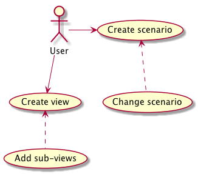
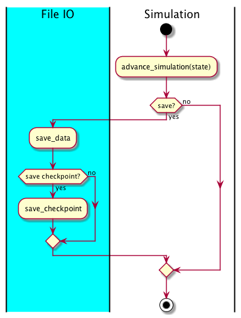

# Developer documentation

## Use case diagram

## Sequence diagram

While the sequence diagram shows the simulation restarted every time the
scenario file is edited, internally we look for opportunities to
cache and reuse computation. So depending on if and how the scenario file
changes the `restart` command may mean the simulation just carries on, or it
restarts from a previous checkpoint in the simulation. Similarly for the
plotting, if the data is unchanged, or if the plotting file is unchanged, the
plot is not redone.

## Simulator loop

### Detail of saving and check-pointing

## Plotter loop

