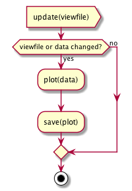

# Developer documentation

## Major classes


*It may turn out that Flightplans need state.

## High level activity diagrams

### (Re)starting a simulation


An important part of making the program more responsive to interactive
trajectory development is to only recompute when it is necessary. We do this by
maintaining periodic checkpoints of the simulation and analyzing changed
scenario files to see if we can restart from an existing checkpoint, rather than
having to start from the begining.

### Central simulator loop


### Serialization threads


## Sequence diagram


While the sequence diagram shows the simulation restarted every time the
scenario file is edited, internally we look for opportunities to
cache and reuse computation. So depending on if and how the scenario file
changes the `restart` command may mean the simulation just carries on, or it
restarts from a previous checkpoint in the simulation. Similarly for the
plotting, if the data is unchanged, or if the plotting file is unchanged, the
plot is not redone.


## Plotter loop



# Design decisions

## Saving data

We will find many fascinating ramblings [here](dev). The one sensible thing I
did was invent the Fractal Downsampler. [Here is a notebook describing
it](dev/adaptive-display-points.ipynb) and a [blog
post](https://kaushikghose.wordpress.com/2017/11/25/adaptively-downsampling-a-curve/).

I considered two ways of saving the data: A) write out each trajectory to a
different file or B) interleave the trajectories in the same file, using a one
or two byte tag to indicate which trajectory each data point belonged to. 

A. creates a bunch of files, but is easier to process for display. B. Is more
compact, but requires more complex pre-processing before display. **When in doubt
do the simpler thing. So the simulator writes out data into a directory with one
file per trajectory.**

Simulated data at each step is passed into the fractal downsampler. When the
downsampler says it's time to save a sample, the sample is written out. Double
buffering is used.

### Output directory organization
The output directory is populated with the following files 
- `params.txt` a copy of the sim params file used to run the simulation
- `posX.bin` where `X` is the NAIF id of the object.
- `bodies.txt` a manifest file listing all the bodies in the simulation
- `events.txt` a list of events and their times

## Why the data are rotated in Python rather than C++
The J2000 frame is aligned with the Earth's axis, which is tilted 23.5 deg to the
eclicptic plane. Aesthetically, charts look much better when plotted with the
eclicptic on the XY-plane, so we rotate the data.

A quick benchmark of a 5 year sim with `de435.bsp` gave the following results

```
Loading and rotating in Python: 17ms
Loading in Python: 7ms

Rotating and saving in C++: 2.3s 
Saving without rotating in C++: 2.188s
```

Now, the benchmarks may not be perfect, but it tipped the decision in favor of
rotatng the data in Python before displaying:

1. It felt icky to hardcode the rotation parameters in the C++ code. Better to
   have it easily and transparently operated in the Python code
2. The benchmarks favored Python.

I left the rotation code in `V3d`, because why not, but removed it from history
to avoid cluttering up the code. It's hard to throw things away, but one must.


# [Current road map](roadmap.md)