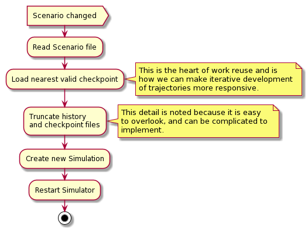
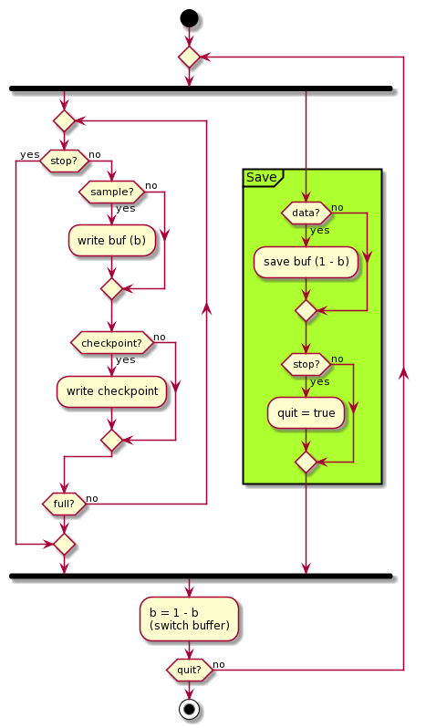

# Developer documentation

## Major classes


*It may turn out that Flightplans need state.

## High level activity diagrams

### (Re)starting a simulation


An important part of making the program more responsive to interactive
trajectory development is to only recompute when it is necessary. We do this by
maintaining periodic checkpoints of the simulation and analyzing changed
scenario files to see if we can restart from an existing checkpoint, rather than
having to start from the begining.

### Central simulator loop


### Serialization threads



## Sequence diagram


While the sequence diagram shows the simulation restarted every time the
scenario file is edited, internally we look for opportunities to
cache and reuse computation. So depending on if and how the scenario file
changes the `restart` command may mean the simulation just carries on, or it
restarts from a previous checkpoint in the simulation. Similarly for the
plotting, if the data is unchanged, or if the plotting file is unchanged, the
plot is not redone.


# Design decisions

## Saving data

We will find many fascinating ramblings [here](dev). The one sensible thing I
did was invent the Fractal Downsampler. [Here is a notebook describing
it](dev/adaptive-display-points.ipynb) and a [blog
post](https://kaushikghose.wordpress.com/2017/11/25/adaptively-downsampling-a-curve/).

I considered two ways of saving the data: A) write out each trajectory to a
different file or B) interleave the trajectories in the same file, using a one
or two byte tag to indicate which trajectory each data point belonged to. 

A. creates a bunch of files, but is easier to process for display. B. Is more
compact, but requires more complex pre-processing before display. **When in doubt
do the simpler thing. So the simulator writes out data into a directory with one
file per trajectory.**

Simulated data at each step is passed into the fractal downsampler. When the
downsampler says it's time to save a sample, the sample is written out. Double
buffering is used.

### Output directory organization
The output directory is populated with the following files 
- `manifest.yml` simulation data for charting program
- `posX.bin` where `X` is the NAIF id of the object.
- `events.txt` a list of events and their times

`manifest.yml` doubles as a file to watch for simulator reruns. It is refreshed
at each run.

## Python/C++ interop
We need a mechanism by which the C++ simulator code can signal to the Python
visualization code that the simulation data is ready. Also, the Python code
should be able to signal to the C++ code when it's still loading the data, so
that the C++ simulator won't restart at the same time and overwrite the old
simulation just yet.

There is a nice list of possibilities [here][so-ipc]. To start with I used a
basic lock file based system. If time permits I will explore more sophisticated
methods. 

[so-ipc]: https://softwareengineering.stackexchange.com/a/262932/108304

On the Python side, the file locking is achieved via
[`py-filelock`](https://pypi.org/project/filelock/) while on the C++ side we use
`fcntl`. We use a RAII idom in the FileLock class
([hpp](https://github.com/kghose/groho/tree/stable/src/simulator/filelock.hpp),
[cpp](https://github.com/kghose/groho/tree/stable/src/simulator/filelock.cpp))

The lock file is called `sim.lock` and is located within the data directory.

### Making lock file and file watching work well together
From the python side we use a [file watcher](https://pypi.org/project/watchdog/)
to trigger replotting when the plot file changes, and reloading and replotting
when the simulation reruns.

Initially I watched the lock file. This was a disaster because it turns out the
`py-filelock` library modifies the file when it locks/unlocks it. This triggered
further watch events, which led to further lock/unlock events ... you get the
idea. So I ended up watching the `manifest.yml` file, and things work fine.

_As a side note, the code does some tricks to make the watchdog code watch a
particular file, rather than a directory. The tricks are a lot simpler than what
you will find on the internet. They are found in the `chartmaker.py` code in the
`EventHandler.dispatch` function_


## Why are the data rotated in Python rather than C++?
The J2000 frame is aligned with the Earth's axis, which is tilted 23.5 deg to the
eclicptic plane. Aesthetically, charts look much better when plotted with the
eclicptic on the XY-plane, so we rotate the data.

A quick benchmark of a 5 year sim with `de435.bsp` gave the following results

```
Loading and rotating in Python: 17ms
Loading in Python: 7ms

Rotating and saving in C++: 2.3s 
Saving without rotating in C++: 2.188s
```

Now, the benchmarks may not be perfect, but it tipped the decision in favor of
rotating the data in Python before displaying:

1. It felt icky to hardcode the rotation parameters in the C++ code. Better to
   have it easily and transparently operated in the Python code
2. The benchmarks favored Python.

I left the rotation code in `V3d`, because why not, but removed it from history
to avoid cluttering up the code. It's hard to throw things away, but one must.

## Checking Scenario file for changes

In the older version of the code (~2018) we used file change detections to drive
simulation restarts. The complication with this was that, since a scenario could
be made of multiple files, we had to track which files made up a scenario and
monitor each one. This made the watcher code complicated.

In the current (2020) incarnation we periodically load the scenario. The loading
process resolves all `insert`s and we get back a list of lines. We then check
the lines for changes. This method is superior to the older file watching method: 

1. The algorithm is simpler: We don't have to keep track of and monitor each
   individual scenario file explicitly. This also gave rise to an issue where we
   could change what files composed a scenario in an edit, and it got
   complicated to update the watchers to track these new files, or remove stale
   files from the watch list.
2. Non-functional changes: adding/removing comments, adding non-functional
   whitespace and so on are ignored in a very natural manner. 

There might be a slight increase in work because we repeatedly reload the
scenario. However these are small text files reloaded at (in CPU time) a low
rate, so the overhead is insignificant.

# [Current road map](roadmap.md)